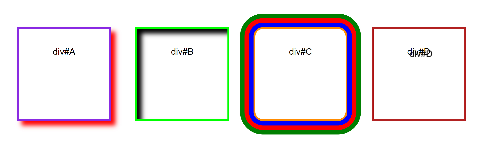

# Chapter 3 Exercises

Each chapter includes one mandatory and one bonus exercise. The mandatory exercise is indicated with a :ballot_box_with_check: and must be completed as part of the Set Exercises assessment. The bonus exercise is optional but completing it opens up the possibility of achieving a grade in the higher mark boundaries.

For each exercise you should create a new folder with the name of the exercise and save it to this exercises folder in your local repository. Once you have completed your solution you should make sure you commit and push your work to GitHub. You can commit and push as many changes to your solutions as you wish; only those pushed before the deadlines will be marked.

## Assessment Exercises 

### Three images :ballot_box_with_check:

In a new index.html file display three images (that you would be legally allowed to use for a commercial project) and do the following: 

* Select a theme which ties all three images together.
* Give each image an appropriate alt attribute.
* Give each image appropriate width and height attributes (retaining its original aspect ratio). 
* Give each image an appropriate title attribute.
* Use CSS filters to change the appearance of all three of your images.
* Ensure each image is under 300kb.
* Underneath each image, provide information on its copyright license. 

<hr>

### Styling those divs (Bonus - Optional)

Using the starter code below edit the files to recreate the image provided 



#### index.html:

```<!DOCTYPE html>
<html lang="en">
  <head>
    <meta charset="UTF-8" />
    <meta http-equiv="X-UA-Compatible" content="IE=edge" />
    <meta name="viewport" content="width=device-width, initial-scale=1.0" />
    <link rel="stylesheet" href="style.css" type="text/css" />
    <link rel="stylesheet" href="additionalStyle.css" type="text/css" />
    <title>Styling those divs</title>
  </head>
  <body>
    <div>div#A</div>
    <div>div#B</div>
    <div>div#C</div>
    <div>div#D</div>
  </body>
</html>
```

#### style.css:

```
div {
  display: inline-block;
  font-family: sans-serif;
  font-size: 20px;
  margin: 25px;
  border: 4px solid black;
  line-height: 100px;
  text-align: center;
  width: 200px;
  height: 200px;
}

body {
  margin: 100px auto;
  width: max-content;
}
```
